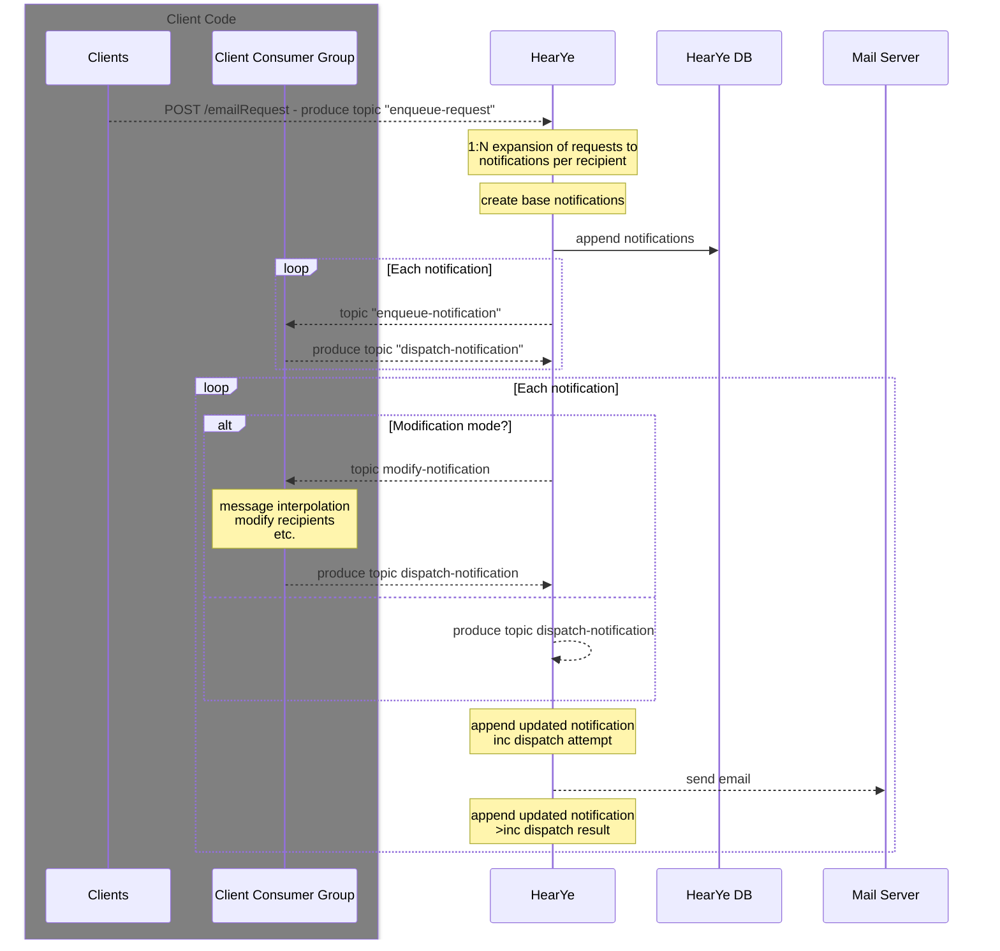

# Architecture

### General Flow
Here we use email as it's the simplest:

```mermaid
sequenceDiagram
    box gray Client Code
        participant Clients
        participant Consumers as Client Consumer Group
    end
    participant HearYe
    participant HearYe DB
    participant Mail Server
    Clients -->> HearYe: POST /emailRequest - produce topic "enqueue-request"
    note over HearYe: 1:N expansion of requests to<br /> notifications per recipient
    note over HearYe: create base notifications
    HearYe ->> HearYe DB: append notifications
    loop Each notification
        HearYe -->> Consumers: topic "enqueue-notification"
        Consumers -->> HearYe: produce topic "dispatch-notification"
    end
    loop Each notification
        alt Modification mode?
            HearYe -->> Consumers: topic modify-notification
            note over Consumers: message interpolation<br />modify recipients<br />etc.
            Consumers -->> HearYe: produce topic dispatch-notification
        else
            HearYe -->> HearYe: produce topic dispatch-notification
        end
        note over HearYe: append updated notification<br />inc dispatch attempt
        HearYe -->> Mail Server: send email
        note over HearYe: append updated notification<br />>inc dispatch result
    end
    
```