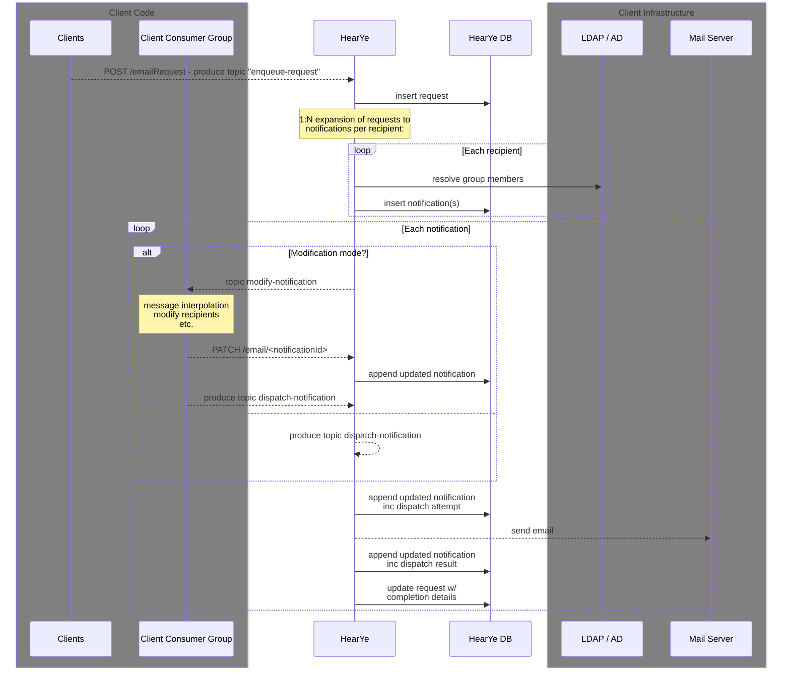

# Architecture

## General Flow
Here we use email as it's the simplest:

### Summary
- **Request notifications**: Clients enqueue notifications to be sent to one or more recipients
- **Notification expansion**: HearYe expands the request into individual notifications, one per 
    recipient. It should support LDAP/AD group expansion to individual recipients.
- **Modification mode**: If the Client requested the ability to modify these notifications, 
    they can listen to a topic. This allows clients make domain-specific modifications that are out of HearYe's scope:
  - **Templating**: string replacement on variables in the message body or subject 
    (their initial request may only include a base template or no message body at all). This allows client code to:
    - Integrate data from other sources
    - Apply domain specific logic to notification bodies
    - Customize messages to each recipient based on their role or other attributes
  - **Recipient modification**: add or remove recipients. Example use cases:
    - CC employee's managers on particular notifications
    - CC a salesperson's support staff on critical messages
    - Forward technical escalations to assigned roles in ticketing system
  - Importantly, modification mode allows clients to colocate their notification logic in one
    set of classes in their application's code base, rather than the transactional points in their applicaiton where 
    a notification might be sent.
  - This allows allows HearYe to be agnostic of domain-specific issues and code, and effectively acts
    allows client code to modify the HearYe pipeline.
- **Immediate mode**: for simpler use cases, clients can opt out of modification mode and send the email as formed in the original client request.
- **Request dispatch**: HearYe handles scaling, retrying, and rate limiting of notifications being sent.